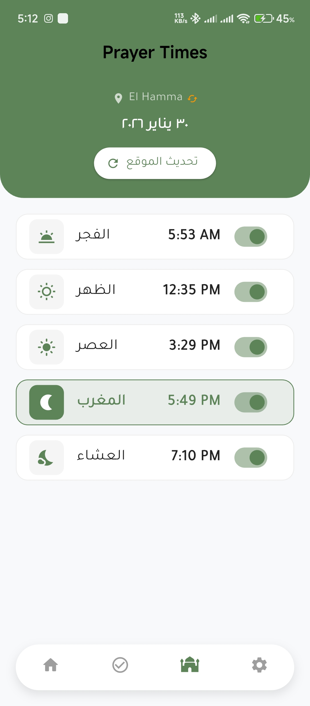
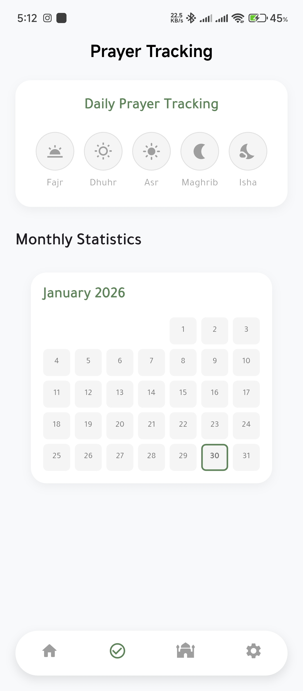
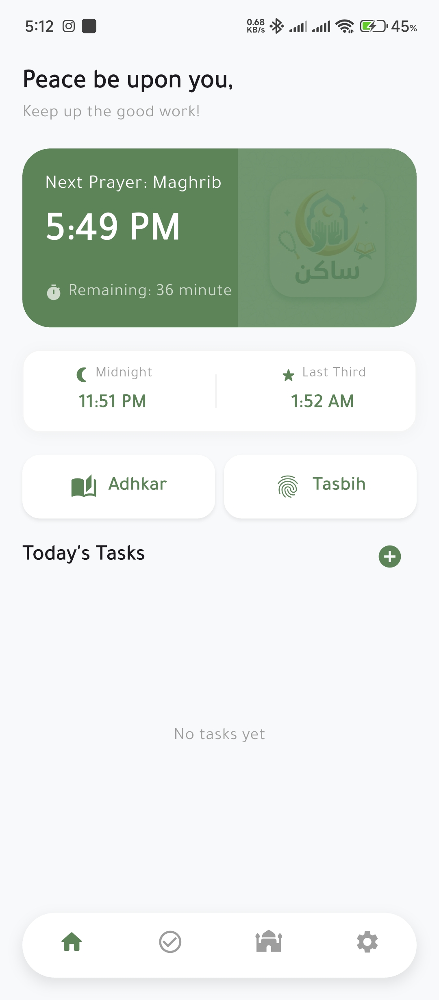
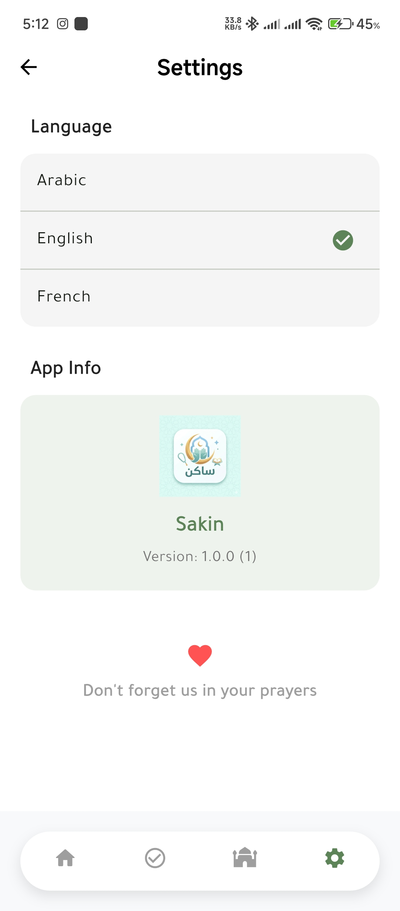

# Sakin App | تطبيق ساكن 🕌 🚀

**Sakin** is a modern, stable, and minimalist Flutter application designed to be your daily spiritual companion. Built with a focus on privacy, sincerity, and offline stability.

**تطبيق ساكن** هو تطبيق عصري، مستقر، وبسيط؛ صُمم ليكون رفيقك الإيماني اليومي. تم بناؤه بتركيز كامل على الخصوصية، المصداقية، والاستقرار حتى بدون اتصال بالإنترنت.

---

## 🌟 Why Sakin? | لماذا تطبيق ساكن؟
We built Sakin with transparency and sincerity as our core values:
لقد قمنا ببناء "ساكن" واضعين المصداقية والشفافية كقيم أساسية لنا:

* **Zero Ads & Tracking**: We believe spiritual apps should be pure. Sakin contains no ads and respects your privacy by storing data locally.
* **تطبيق بدون إعلانات أو تتبع**: نؤمن بأن التطبيقات الإيمانية يجب أن تكون نقية؛ لذا "ساكن" لا يحتوي على إعلانات ويحترم خصوصيتك بحفظ البيانات محلياً.
* **Android 15 Optimized**: Developed to run smoothly on the latest Android versions without battery drain.
* **محسن لأندرويد 15**: تم تطويره ليعمل بسلاسة على أحدث أنظمة أندرويد دون استهلاك مفرط للبطارية.
* **Verified Content**: All dhikr and prayer times are carefully calculated and reviewed.
* **محتوى مدقق**: جميع الأذكار ومواقيت الصلاة تم حسابها ومراجعتها بعناية.

---

## ✨ Features | المميزات الحالية
- ✅ **Smart Prayer Times**: Real-time updates with offline caching using Hive.
- ✅ **Adhan System**: Full background audio support even on latest Android APIs.
- ✅ **Daily Tracking**: Track your prayers and habits with a beautiful monthly view.
- ✅ **Qiam-ul-Layl**: Dedicated timings for Midnight and the Last Third of the night.
- ✅ **Multi-language**: Support for Arabic, English, and French.

---

## 📸 Screenshots | لقطات من التطبيق

  
  
  
  

---

## 🚀 Road to Play Store | الطريق إلى متجر جوجل
We are working hard to fulfill all requirements to publish **Sakin** on the **Google Play Store** very soon, Insha'Allah.
نعمل بجد لاستيفاء كافة المعايير لنشر تطبيق **ساكن** على متجر **جوجل بلاي** قريباً بإذن الله.

---

## 🤝 Open Source & License
This project is licensed under the **GNU GPL v3**. We welcome contributions from developers worldwide to improve and audit the code.
هذا المشروع مرخص بموجب **GNU GPL v3**. نرحب بمساهمات المبرمجين من جميع أنحاء العالم لتحسين وتدقيق الكود.

---

## 📢 Feedback & Support | تواصل معنا
Your feedback helps us grow! reach out via:
رأيك يهمنا لتطوير "ساكن"! تواصل معنا عبر:

📧 **Email**: [fakhr.farhat@gmail.com](mailto:fakhr.farhat@gmail.com)
💬 **WhatsApp**: [+216 94 380 416](https://wa.me/21694380416)
📸 **Instagram**: [@fd_farhat](https://instagram.com/fd_farhat)

---
**Note:** Download the latest stable Release APK from the [Releases](https://github.com/Xoner1/-sakin-app/releases) section.
